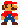

# peardeck-drawbot
</img>

^Play this video to see it in action

</img>

^This took 0:30 to draw

To use the code, either paste the contents drawbot.js into console, or run the python version (for developers)

